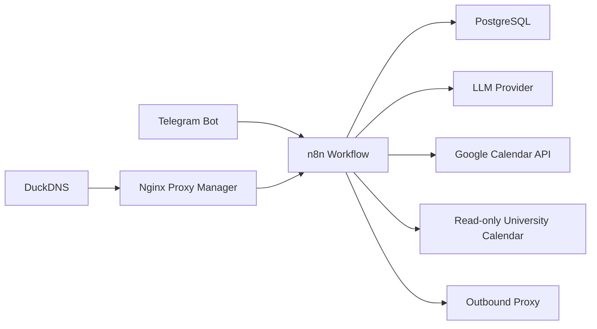

# Telegram Scheduling AI Agent

Telegram-based personal scheduling assistant built on **n8n**, **PostgreSQL**, **Google Calendar**, and an LLM provider. The project is designed as a small data-engineering system: it stores conversation state, curates long-term memory, reads multiple calendars, and exposes operationally reproducible infrastructure.

The current implementation is deployed on a VM and serves a Telegram bot that can:

- plan study/work blocks from natural language messages;
- read personal Google Calendar events;
- read a separate read-only university schedule calendar;
- create, update, delete, and inspect personal calendar events;
- maintain short-term chat history and long-term user memory;
- soft-delete and version long-term memory records instead of losing history.

## Why This Is a Data Engineering Project

This is not only a chatbot workflow. The interesting part is the data layer around it:

- **PostgreSQL-backed memory** for chat history and curated long-term facts.
- **Session-scoped data model** keyed by Telegram chat id.
- **Core vs searchable memory split** to reduce prompt bloat.
- **Soft-expiration strategy** for memory deletion and updates.
- **External calendar ingestion** through Google Calendar APIs.
- **Containerized runtime** with n8n, Postgres, reverse proxy, DNS updater, and outbound proxy.
- **Operational playbooks** for debugging n8n executions, proxy issues, and database state.

## Architecture



## Repository Layout

```text
.
├── docs/                 # Architecture, data model, memory, operations
├── infra/                # Docker Compose and proxy config templates
├── sql/                  # Database schema and migrations
├── workflows/            # Sanitized n8n workflow documentation/export
├── scripts/              # Operational helper scripts
└── assets/screenshots/   # Screenshot placeholders for the portfolio README
```

## Screenshots

Screenshots are intentionally not committed yet. Add them later to:

- `assets/screenshots/n8n-workflow.png`
- `assets/screenshots/telegram-demo.png`
- `assets/screenshots/calendar-event-created.png`
- `assets/screenshots/postgres-memory-query.png`

See [docs/screenshots.md](docs/screenshots.md) for what each screenshot should show.

## Current Workflow

The production n8n workflow is documented in [workflows/scheduling-agent.sanitized.json](workflows/scheduling-agent.sanitized.json). It is sanitized: credentials, real tokens, and personal calendar ids are not stored in the repository.

Main nodes:

- Telegram Trigger
- Load and Save Long-Term Context
- AI Agent
- Postgres Chat Memory
- Google Gemini Chat Model
- Google Calendar tools
- Long-term memory tools
- Telegram Reply

## Memory Model

Memory is split into three layers:

1. **Postgres Chat Memory**: short-term conversation history in `n8n_chat_histories`.
2. **Core Long-Term Memory**: always-loaded active facts from `user_context` where `is_core = true`.
3. **Searchable Long-Term Memory**: active facts in `user_context` that the agent fetches on demand.

Details are in [docs/memory.md](docs/memory.md).

## Deployment

The deployment uses:

- `n8nio/n8n`
- `postgres:16-alpine`
- `jc21/nginx-proxy-manager`
- `lscr.io/linuxserver/duckdns`
- `ghcr.io/sagernet/sing-box`

Start from:

```bash
cp .env.example .env
docker compose -f infra/docker-compose.example.yml up -d
```

The example Compose file is a template. Production secrets and provider credentials must be configured outside Git.

## Operational Notes

Useful checks:

```bash
docker compose ps
docker logs --tail 100 ai-agent-n8n-1
docker exec ai-agent-db-1 psql -U "$POSTGRES_USER" -d "$POSTGRES_DB"
```

More runbook details are in [docs/operations.md](docs/operations.md).

## Roadmap

- [ ] Add media ingestion branch for photos, documents, PDFs, and voice messages.
- [ ] Add a small backend for multi-user OAuth and per-user model keys.
- [ ] Add structured calendar sync cache for university schedule analytics.
- [ ] Add observability dashboards for execution failures and memory growth.
- [ ] Add automated export of sanitized n8n workflows.

