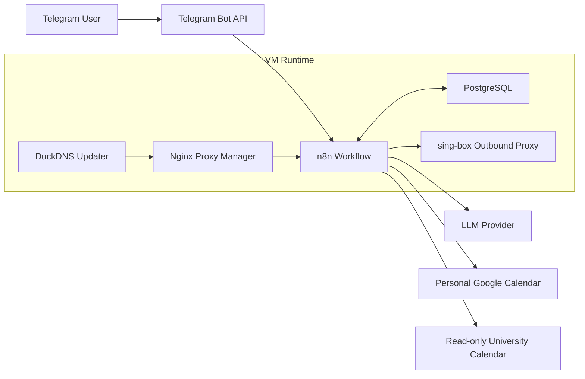
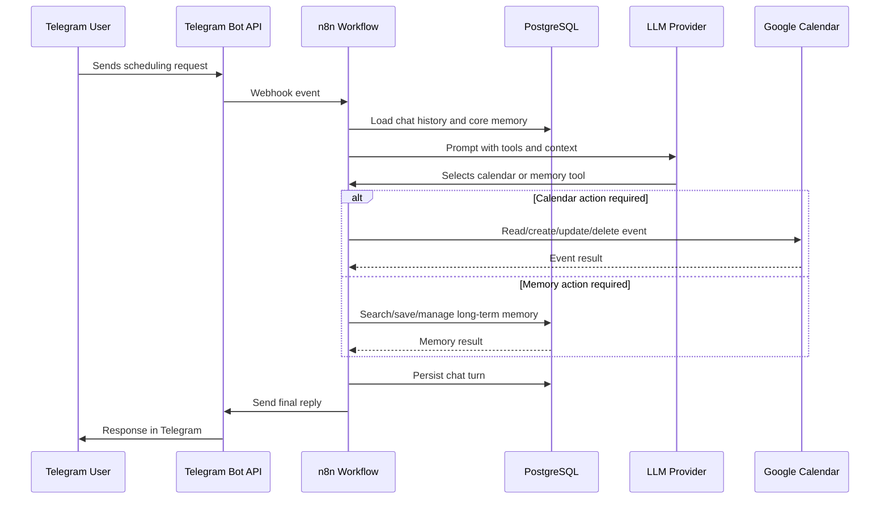
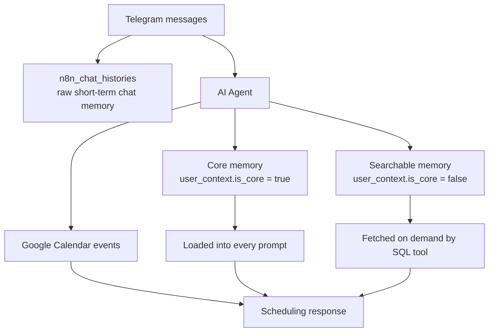
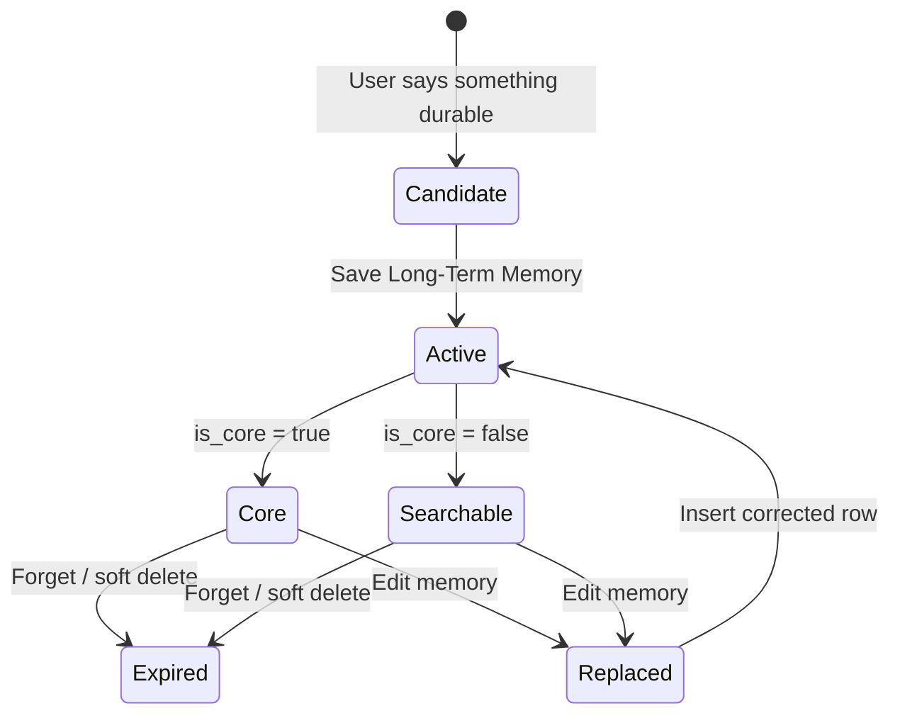
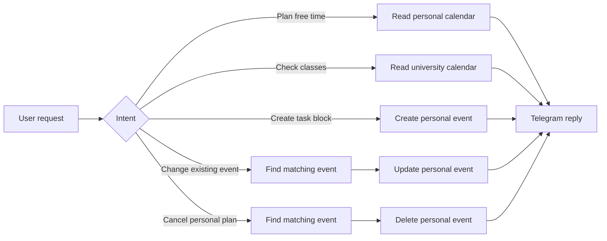
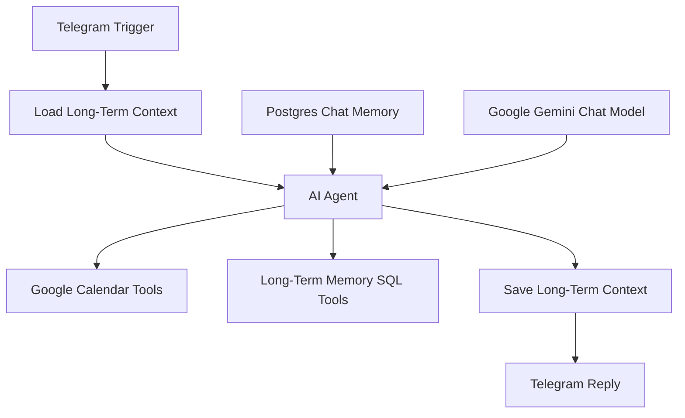
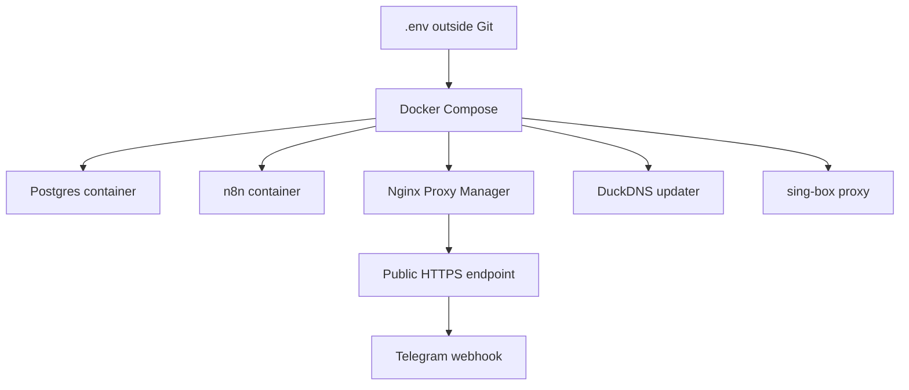

# Telegram Scheduling AI Agent

[Русская версия](README_RUS.md)

Telegram-based personal scheduling assistant built on **n8n**, **PostgreSQL**, **Google Calendar**, and an LLM provider. The project is not just a chatbot demo: it is a small data product around an AI assistant, with persistent memory, calendar tool routing, operational playbooks, and reproducible infrastructure.

The production version is deployed on a VM and serves a Telegram bot that can plan study/work blocks, inspect calendars, create or update events, remember stable user preferences, and keep an audit-friendly history of long-term memory changes.

## Highlights

| Area | What is implemented |
| --- | --- |
| Interface | Telegram bot for natural-language scheduling requests. |
| Orchestration | n8n workflow with Telegram trigger, AI Agent, SQL tools, memory, calendar tools, and reply handling. |
| State layer | PostgreSQL for n8n metadata, chat history, curated long-term memory, and planned media metadata. |
| Memory design | Short-term chat memory, always-loaded core facts, searchable long-term facts, soft deletes, and replacement history. |
| Calendar integration | Personal writable Google Calendar plus separate read-only university schedule calendar. |
| Infrastructure | Docker Compose stack with n8n, Postgres, Nginx Proxy Manager, DuckDNS, and outbound proxy. |
| Security hygiene | Sanitized workflow export, `.env.example`, no committed production tokens or calendar ids. |
| Operations | Runbooks for containers, n8n executions, PostgreSQL state, proxy failures, and calendar credentials. |

## What The Bot Can Do

- Plan study and work blocks from natural-language Telegram messages.
- Read personal Google Calendar events.
- Read a separate read-only university schedule calendar.
- Create, update, delete, and inspect personal calendar events.
- Avoid scheduling personal tasks over known university classes.
- Maintain short-term chat history in PostgreSQL through n8n LangChain memory.
- Store curated long-term facts such as goals, constraints, preferences, recurring commitments, and project context.
- Soft-delete and version long-term memory records instead of physically overwriting history.

## Screenshots

The screenshots below show the deployed workflow, Telegram interaction, calendar result, and PostgreSQL-backed memory state.

### n8n Workflow


### Telegram Demo


### Calendar Event Created


### PostgreSQL Memory Query


See [docs/screenshots.md](docs/screenshots.md) for the screenshot checklist and privacy notes.

## System Architecture



## Request Flow



## Data Layer

The most important part of this project is the state model around the AI agent. The workflow separates raw chat history from curated facts, which keeps prompts smaller and makes long-term memory easier to inspect and correct.



| Table | Role |
| --- | --- |
| `n8n_chat_histories` | Raw short-term conversation history managed by n8n LangChain Postgres Chat Memory. |
| `user_context` | Durable curated memory with category, priority, confidence, core/searchable split, and expiration. |
| `media_assets` | Planned metadata table for Telegram attachments, extracted text, summaries, and storage references. |

Active long-term memory uses this predicate:

```sql
expires_at IS NULL OR expires_at > CURRENT_TIMESTAMP
```

## Memory Lifecycle

Long-term memory is intentionally append-friendly. The agent does not physically delete or overwrite important rows; it expires old rows and inserts corrected replacements. This makes wrong memory operations recoverable and gives the system an audit trail.



Memory quality rules:

- Store durable scheduling context, not every chat message.
- Scope facts to the correct `telegram:<chat_id>` session.
- Keep core memory small and high-signal.
- Use searchable memory for project details, course context, deadlines, and less frequent preferences.
- Avoid storing secrets or sensitive credentials.

## Calendar Tooling

The bot works with two different calendar surfaces, each with separate behavior.



| Calendar | Access | Purpose |
| --- | --- | --- |
| Personal calendar | Read/write | Personal study blocks, work plans, reminders, event updates and deletions. |
| University schedule | Read-only | Class lookup, free-window detection, conflict avoidance. |

Future extension: ingest university schedule events into a normalized cache table for SQL analytics over study load, free time windows, and schedule conflicts.

## Workflow Components

The production n8n workflow is documented in [workflows/scheduling-agent.sanitized.json](workflows/scheduling-agent.sanitized.json). The export is sanitized: credentials, real tokens, and personal calendar ids are not stored in the repository.



Main nodes:

- Telegram Trigger
- Load and Save Long-Term Context
- AI Agent
- Postgres Chat Memory
- Google Gemini Chat Model
- Google Calendar tools
- Long-term memory SQL tools
- Telegram Reply

## Repository Layout

```text
.
├── assets/screenshots/   # README screenshots
├── docs/                 # Architecture, data model, memory, calendar, operations
├── infra/                # Docker Compose and proxy config templates
├── scripts/              # Operational helper scripts
├── sql/                  # Database schema, migrations, analytics examples
└── workflows/            # Sanitized n8n workflow documentation/export
```

## Deployment

The deployment uses:

- `n8nio/n8n`
- `postgres:16-alpine`
- `jc21/nginx-proxy-manager`
- `lscr.io/linuxserver/duckdns`
- `ghcr.io/sagernet/sing-box`

Start from:

```bash
cp .env.example .env
docker compose -f infra/docker-compose.example.yml up -d
```

The example Compose file is a template. Production secrets and provider credentials must be configured outside Git.



## Operations

Useful checks:

```bash
docker compose ps
docker logs --tail 100 ai-agent-n8n-1
docker exec ai-agent-db-1 psql -U "$POSTGRES_USER" -d "$POSTGRES_DB"
```

Useful memory query:

```sql
SELECT id, session_id, category, priority, is_core, expires_at, content
FROM user_context
WHERE expires_at IS NULL OR expires_at > CURRENT_TIMESTAMP
ORDER BY is_core DESC, priority DESC, updated_at DESC;
```

Common failure classes documented in [docs/operations.md](docs/operations.md):

- model provider quota exceeded;
- outbound proxy unavailable;
- Telegram webhook registration failure;
- Google Calendar credential expiration;
- invalid SQL tool parameters generated by the agent.

## Analytics Opportunities

The current schema already supports operational analytics:

- memory growth per user;
- ratio of core to searchable memory;
- stale memory records;
- failed executions by node;
- model quota failures over time;
- calendar write frequency.

Planned normalized calendar ingestion would enable:

- study hours per week;
- free time windows;
- conflicts between personal plans and university classes;
- schedule volatility from imported calendar changes.

## Documentation

- [Architecture](docs/architecture.md)
- [Calendar integration](docs/calendar.md)
- [Data model](docs/data-model.md)
- [Memory design](docs/memory.md)
- [Data engineering notes](docs/data-engineering-notes.md)
- [Operations runbook](docs/operations.md)
- [Screenshot checklist](docs/screenshots.md)

## Roadmap

- [ ] Add media ingestion branch for photos, documents, PDFs, and voice messages.
- [ ] Add a small backend for multi-user OAuth and per-user model keys.
- [ ] Add structured calendar sync cache for university schedule analytics.
- [ ] Add observability dashboards for execution failures and memory growth.
- [ ] Add automated export of sanitized n8n workflows.
