# Telegram AI-агент для планирования

[English version](README.md)

Персональный Telegram-ассистент для планирования, собранный на **n8n**, **PostgreSQL**, **Google Calendar** и LLM-провайдере. Это не просто демо чат-бота: проект оформлен как небольшой data product вокруг AI-агента, с persistent memory, routing-ом инструментов, operational playbooks и воспроизводимой инфраструктурой.

Production-версия развернута на VM и обслуживает Telegram-бота, который умеет планировать учебные и рабочие блоки, проверять календари, создавать и обновлять события, помнить устойчивые пользовательские предпочтения и хранить историю изменений долгосрочной памяти.

## Ключевые Возможности

| Область | Что реализовано |
| --- | --- |
| Интерфейс | Telegram-бот для запросов на естественном языке. |
| Оркестрация | n8n workflow с Telegram trigger, AI Agent, SQL tools, memory, calendar tools и reply handling. |
| State layer | PostgreSQL для n8n metadata, истории чата, curated long-term memory и planned media metadata. |
| Memory design | Short-term chat memory, always-loaded core facts, searchable long-term facts, soft deletes и replacement history. |
| Calendar integration | Личный writable Google Calendar и отдельный read-only календарь университетского расписания. |
| Инфраструктура | Docker Compose stack с n8n, Postgres, Nginx Proxy Manager, DuckDNS и outbound proxy. |
| Security hygiene | Sanitized workflow export, `.env.example`, без production tokens и calendar ids в Git. |
| Operations | Runbook-и для containers, n8n executions, PostgreSQL state, proxy failures и calendar credentials. |

## Что Умеет Бот

- Планировать учебные и рабочие блоки по Telegram-сообщениям на естественном языке.
- Читать события личного Google Calendar.
- Читать отдельный read-only календарь с университетским расписанием.
- Создавать, обновлять, удалять и проверять личные события календаря.
- Не ставить личные задачи поверх известных учебных занятий.
- Хранить краткосрочную историю чата в PostgreSQL через n8n LangChain memory.
- Сохранять долгосрочные факты: цели, ограничения, предпочтения, регулярные обязательства и контекст проектов.
- Мягко удалять и версионировать long-term memory records вместо физического перезаписывания истории.

## Скриншоты

Скриншоты ниже показывают развернутый workflow, взаимодействие в Telegram, результат в календаре и состояние памяти в PostgreSQL.

### n8n Workflow

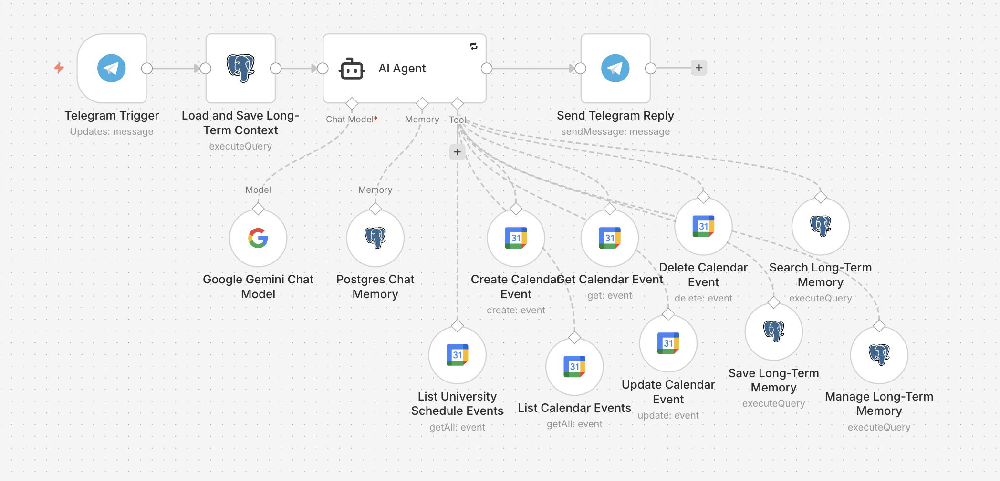

### Telegram Demo

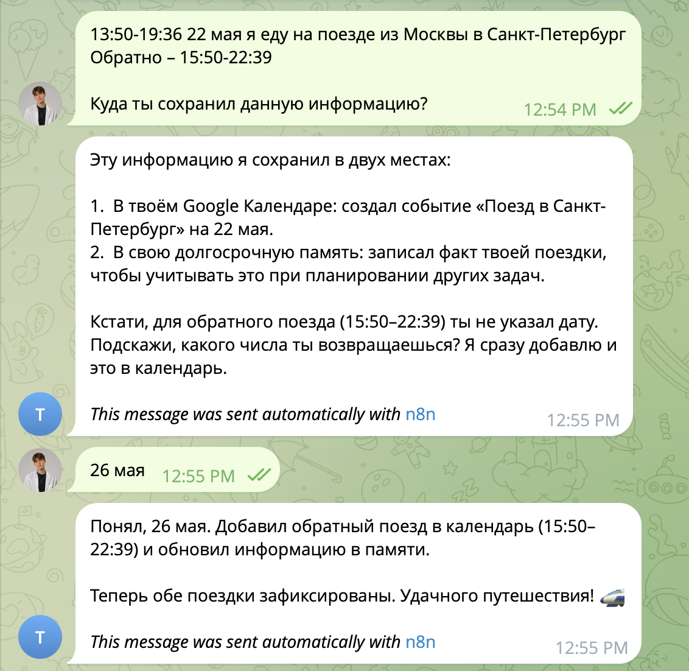

### Созданное Событие В Календаре

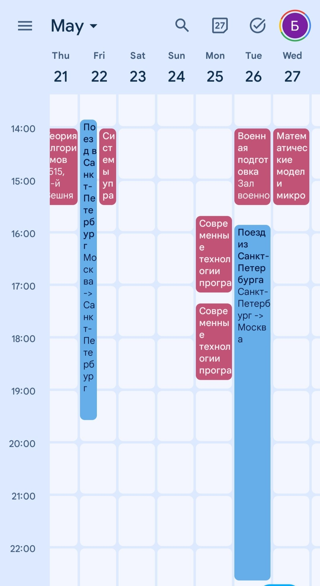

### PostgreSQL Memory Query

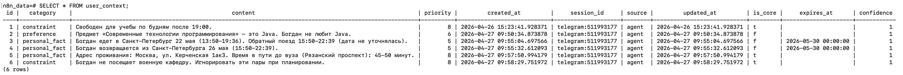

Privacy checklist для скриншотов описан в [docs/screenshots.md](docs/screenshots.md).

## Архитектура Системы

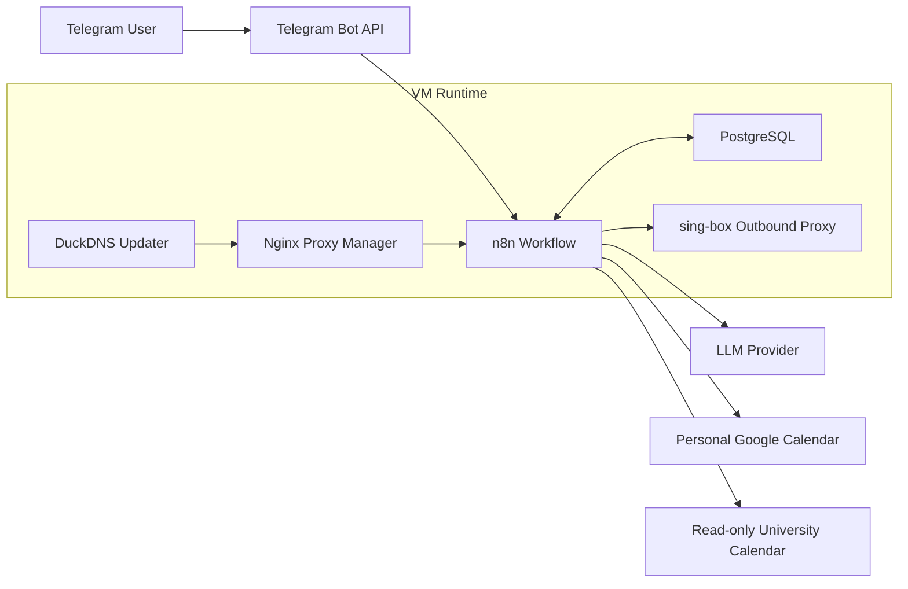

## Request Flow

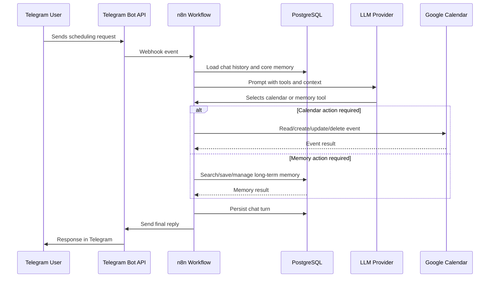

## Data Layer

Самая важная часть проекта - state model вокруг AI-агента. Workflow разделяет сырую историю чата и curated facts. Это уменьшает размер prompt-ов и делает long-term memory проверяемой и исправляемой.

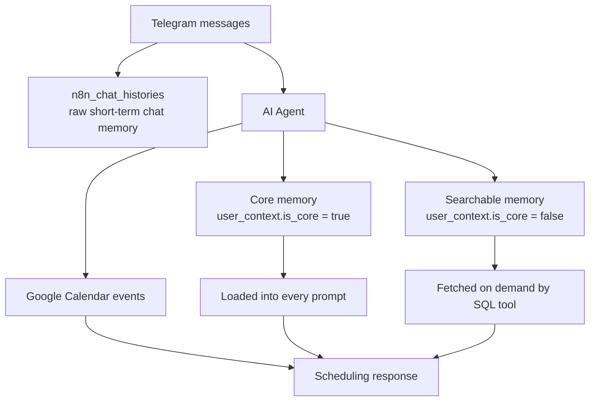

| Таблица | Роль |
| --- | --- |
| `n8n_chat_histories` | Сырая краткосрочная история диалога, которой управляет n8n LangChain Postgres Chat Memory. |
| `user_context` | Долгосрочная curated memory с category, priority, confidence, core/searchable split и expiration. |
| `media_assets` | Запланированная metadata table для Telegram attachments, extracted text, summaries и storage references. |

Активная long-term memory выбирается по условию:

```sql
expires_at IS NULL OR expires_at > CURRENT_TIMESTAMP
```

## Memory Lifecycle

Long-term memory сделана append-friendly. Агент не удаляет и не перезаписывает важные строки физически: старые записи истекают, а исправленные версии вставляются новыми строками. Так ошибочные memory operations можно откатить или проанализировать.

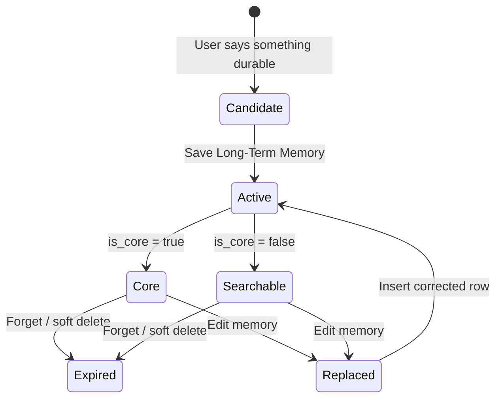

Правила качества памяти:

- Сохранять устойчивый scheduling context, а не каждое сообщение.
- Привязывать факты к правильной `telegram:<chat_id>` session.
- Держать core memory маленькой и высокосигнальной.
- Использовать searchable memory для деталей проектов, учебного контекста, дедлайнов и редких предпочтений.
- Не сохранять secrets и чувствительные credentials.

## Calendar Tooling

Бот работает с двумя календарными поверхностями, у которых разные права и сценарии.

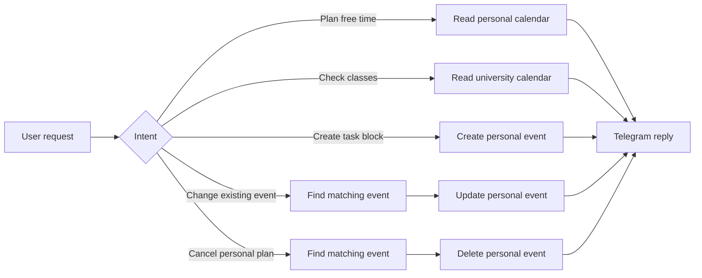

| Календарь | Доступ | Назначение |
| --- | --- | --- |
| Personal calendar | Read/write | Личные учебные блоки, рабочие планы, reminders, event updates и deletions. |
| University schedule | Read-only | Проверка занятий, поиск свободных окон, предотвращение конфликтов. |

Планируемое расширение: загружать университетское расписание в normalized cache table для SQL-аналитики учебной нагрузки, свободного времени и конфликтов.

## Workflow Components

Production n8n workflow описан в [workflows/scheduling-agent.sanitized.json](workflows/scheduling-agent.sanitized.json). Export очищен от чувствительных данных: credentials, реальные tokens и личные calendar ids не хранятся в репозитории.

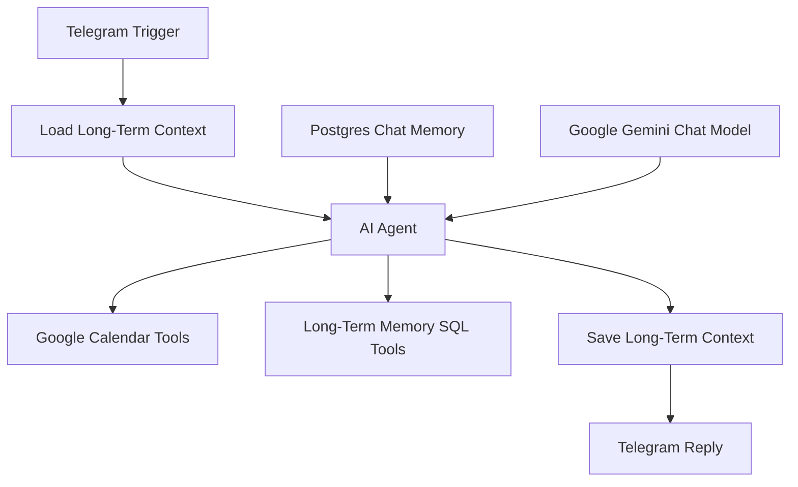

Основные nodes:

- Telegram Trigger
- Load and Save Long-Term Context
- AI Agent
- Postgres Chat Memory
- Google Gemini Chat Model
- Google Calendar tools
- Long-term memory SQL tools
- Telegram Reply

## Структура Репозитория

```text
.
├── assets/screenshots/   # README screenshots
├── docs/                 # Architecture, data model, memory, calendar, operations
├── infra/                # Docker Compose and proxy config templates
├── scripts/              # Operational helper scripts
├── sql/                  # Database schema, migrations, analytics examples
└── workflows/            # Sanitized n8n workflow documentation/export
```

## Развертывание

В deployment используются:

- `n8nio/n8n`
- `postgres:16-alpine`
- `jc21/nginx-proxy-manager`
- `lscr.io/linuxserver/duckdns`
- `ghcr.io/sagernet/sing-box`

Старт:

```bash
cp .env.example .env
docker compose -f infra/docker-compose.example.yml up -d
```

Example Compose file является шаблоном. Production secrets и provider credentials должны настраиваться вне Git.

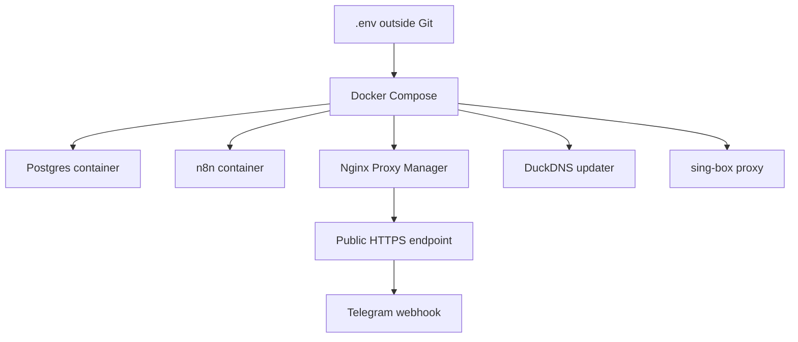

## Operations

Полезные проверки:

```bash
docker compose ps
docker logs --tail 100 ai-agent-n8n-1
docker exec ai-agent-db-1 psql -U "$POSTGRES_USER" -d "$POSTGRES_DB"
```

Полезный memory query:

```sql
SELECT id, session_id, category, priority, is_core, expires_at, content
FROM user_context
WHERE expires_at IS NULL OR expires_at > CURRENT_TIMESTAMP
ORDER BY is_core DESC, priority DESC, updated_at DESC;
```

Типовые классы сбоев описаны в [docs/operations.md](docs/operations.md):

- превышение quota у model provider;
- недоступность outbound proxy;
- ошибка регистрации Telegram webhook;
- истечение Google Calendar credentials;
- invalid SQL tool parameters, сгенерированные агентом.

## Analytics Opportunities

Текущая schema уже позволяет делать operational analytics:

- memory growth per user;
- ratio of core to searchable memory;
- stale memory records;
- failed executions by node;
- model quota failures over time;
- calendar write frequency.

Планируемая normalized calendar ingestion позволит считать:

- study hours per week;
- free time windows;
- conflicts between personal plans and university classes;
- schedule volatility from imported calendar changes.

## Документация

- [Architecture](docs/architecture.md)
- [Calendar integration](docs/calendar.md)
- [Data model](docs/data-model.md)
- [Memory design](docs/memory.md)
- [Data engineering notes](docs/data-engineering-notes.md)
- [Operations runbook](docs/operations.md)
- [Screenshot checklist](docs/screenshots.md)

## Roadmap

- [ ] Добавить ветку media ingestion для photos, documents, PDFs и voice messages.
- [ ] Добавить небольшой backend для multi-user OAuth и per-user model keys.
- [ ] Добавить structured calendar sync cache для аналитики университетского расписания.
- [ ] Добавить observability dashboards для execution failures и роста memory.
- [ ] Добавить автоматический export sanitized n8n workflows.
