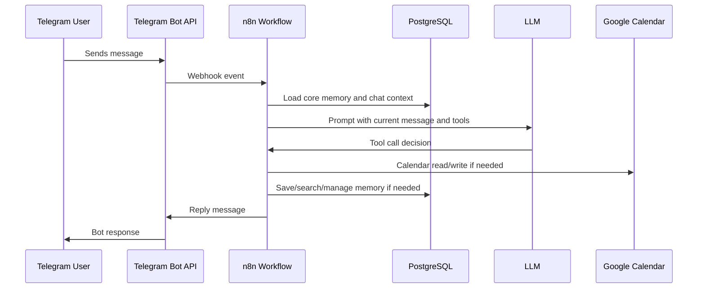

# Architecture

The system is a Telegram-first scheduling assistant with n8n as the orchestration layer and PostgreSQL as the state layer.

## Runtime Components

| Component | Responsibility |
| --- | --- |
| Telegram Bot | User interface for natural language scheduling requests. |
| n8n | Workflow orchestration, tool routing, retries, and execution logs. |
| PostgreSQL | n8n metadata, chat memory, curated long-term memory, planned media metadata. |
| Google Calendar API | Personal calendar CRUD and read-only university schedule access. |
| LLM Provider | Natural language reasoning and tool selection. |
| Nginx Proxy Manager | HTTPS termination and public routing. |
| DuckDNS | Dynamic DNS for the VM. |
| sing-box | Outbound HTTP proxy for provider APIs when direct access is unavailable. |

## Message Flow

## Design Choices

### n8n as Orchestrator

n8n provides a fast way to connect Telegram, calendar APIs, LLM tools, and PostgreSQL. The tradeoff is that complex multi-user credential management is harder than in a custom backend.

### PostgreSQL as the Source of State

PostgreSQL stores:

- n8n workflow metadata and executions;
- short-term chat history through LangChain memory;
- curated long-term memory in a custom table;
- future media metadata.

### Soft Deletes for Memory

Long-term memory records are never physically deleted by the agent. Deletion sets `expires_at = CURRENT_TIMESTAMP`. Edits expire the old row and insert a corrected replacement.

This keeps a history trail and makes bad memory operations recoverable.

