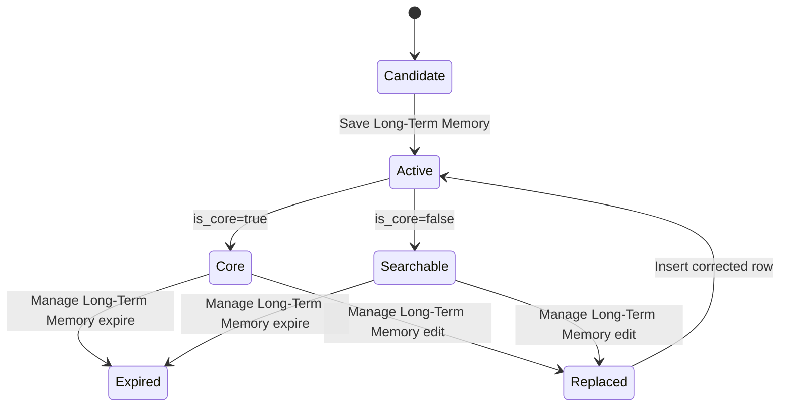

# Data Engineering Notes

This project is intentionally framed as a data product around an AI assistant.

## Data Sources

| Source | Type | Ingestion mode | Storage |
| --- | --- | --- | --- |
| Telegram messages | Event stream | Webhook | n8n execution data, chat memory |
| LLM messages | Generated events | n8n LangChain memory | `n8n_chat_histories` |
| Curated memories | Agent-selected facts | SQL tools | `user_context` |
| Google Calendar | API data | Tool calls | Live API, future cache |
| University schedule | Read-only calendar feed | Tool calls | Live API, future cache |
| Media attachments | Files | Planned Telegram file download | `media_assets` + filesystem/object storage |

## Data Quality Rules

Long-term memory should be:

- durable, not a one-off instruction;
- useful for future scheduling;
- scoped to the correct Telegram session;
- free of secrets;
- concise enough to fit into prompts or search results.

## Memory Lifecycle

## Analytics Opportunities

The current schema already allows useful operational analytics:

- memory growth per user;
- ratio of core to searchable memory;
- stale memory records;
- failed executions by node;
- model quota failures over time;
- calendar write frequency.

Future normalized calendar ingestion would make it possible to compute:

- study hours per week;
- free time windows;
- conflicts between personal plans and university classes;
- schedule volatility from imported calendar changes.

