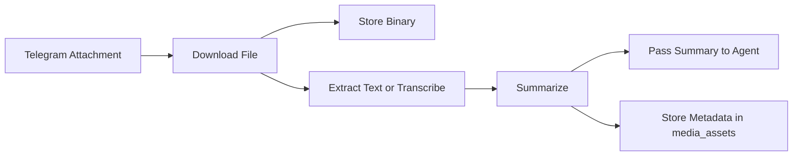

# Roadmap

## Media Ingestion

Add support for Telegram attachments:

- photos and screenshots;
- PDFs and documents;
- voice messages;
- schedule images from university systems.

Recommended pipeline:



## Multi-User Credentials

The memory schema already supports multiple Telegram users through `session_id`.

The hard part is per-user credentials:

- Google OAuth refresh tokens;
- per-user model API keys;
- revocation and rotation;
- encrypted secret storage.

Recommended architecture:

```text
Telegram -> n8n -> small backend API -> encrypted credentials table -> provider APIs
```

n8n should remain the orchestrator. A small backend should own OAuth callbacks, encryption, token refresh, and per-user provider calls.

## Calendar Cache

Move read-only schedule data into a normalized cache:

- recurring load from Google Calendar;
- event id + content hash for change detection;
- analytics over study load and free windows.

## Observability

Add a lightweight reporting layer:

- failed executions by day;
- failing node names;
- model provider errors;
- calendar write operations;
- memory row growth.

